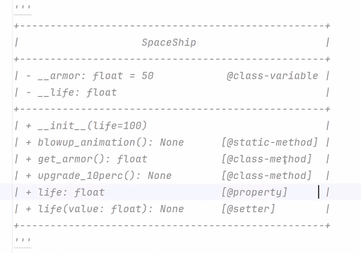

# python-OOP-Lec4-21-MAY-25
* all dunder functions come from the super class Object.
  * therefore when we override these functions need to add the metadata @override and import it:
    * from typing import override
* shortcut: @props will create getter and setters
* if we want to use the protection of the getters and setters in the init function better to call the setter:
  * self.radius=_radius
  * same every when want to set/get the private property:
    * instead self.__radius, use self.radius , because it calls the setter/getter functions
* can create @property for parameter, even if it's not attribute in the class.
  * this is instead to call function, call the "property":
    * instead function def get_area(self)=> create @property def area(self)
    * then we can access the area property: c1.area
* Class member/variable (static property):
  *  static parameter will be a part of the class and not part of the object,
  * it will be defined 1 time in the class and not for each instance!
  ```
  class Circle:
    pie=3.14 # not related to self 
    def __init__(self):....
  ```
  * to access it : Circle.pie
    * c1.pie works, but bad practice, because it's not instance property.
    * if it was private, need to create classmethod and the call it:
    ```
    @classmethod
    def get_pie(cls): #cls= class, instead of self
      return cls.__pie# =Class.__pie
    ```
    * like @classmethod , the @staticmethod, the function exist 1 one. 
      * but without access to cls and self.
      * examples:
        ```
        @staticmethod
        def create_random_circle():
            return Circle(random.randint(100))
        
        @staticmethod
        def description():
            return "this is class shape in static method"
        ```
  * can be private / public. 
    * if private:  __pie
      * getter/setter: without @property, need manual classmethod functions:
      ```
      @classmethod
      @property
      def p(cls):
        return cls.__pie
      # not setter
      
      # or simple get function
      @classmethod
      def get_pie(cls)
        return cls.__pie
      
      @classmethod
      def set_pie(cls,v)
        cls.__pie=v
      ```
  * if it's private, can be access only within the class and not outside it.
  * unlike instance member (self.radius)
* the known order in class:
  1) class variables
  2) __init__
  3) @classmethod
  4) @staticmethod
  5) instance methods
* in UML: 
  * -__armor:float=50 private
  * for each function add on the side the "type" of the function
  * 